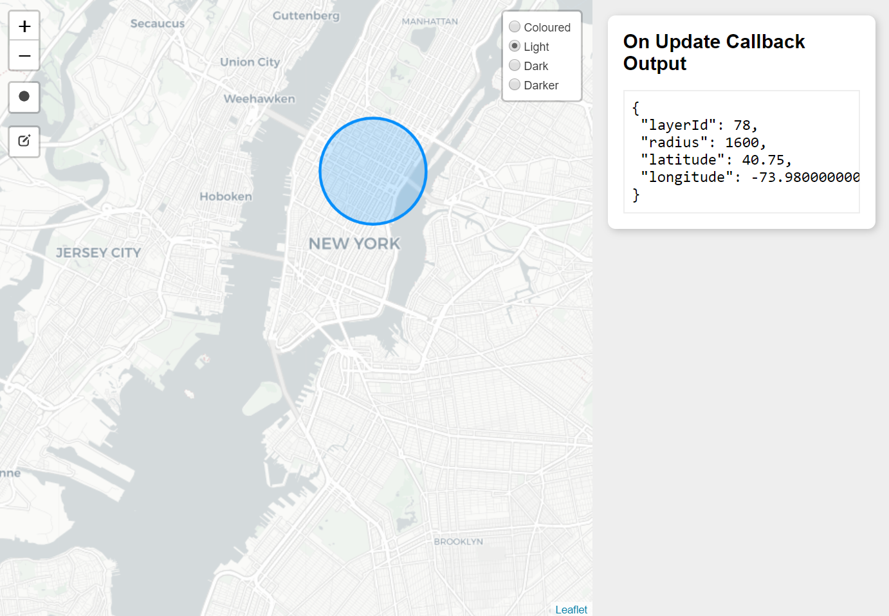

# radius-map

Preconfigured `leaflet` map using a circle from `leaflet-draw` for implementing a within radius search on a map.
 


## Docs

* https://puiutucutu.github.io/radius-map/

## Features

* programatically draw a circle
* callback hooks for on draw and on draw error
* does not bundle `leaflet` or `leaflet-draw` dependencies making for a light build (264 kB)

## Use

### Browser

Import `radius-map.umd.js` and access it via the `radiusMap` window global as in `radiusMap.RadiusMap(...)`.

Since `leaflet` and `leaflet-draw` are dependencies, they must be loaded before `radius-map` so that `L` and `L.draw` exist in the browser's global namespace.

See example at `./examples/browser`.

### Node

Only one export is provided via `./dist/radius-map.ejs.js`.

See example at `./examples/node`.

#### Install

```
npm install radius-map
```

#### Importing and Usage

Similar to the `umd` build, the `ejs` build requires `leaflet` and `leaflet-draw` to be imported seperately.

After importing `radius-map`, your bundling tool is responsible for bundling the `leaflet` and `leaflet-draw` dependencies.

```js
import L from "leaflet";
import "leaflet-draw";
import { RadiusMap } from "radius-map";
import "leaflet/dist/leaflet.css";
import "leaflet-draw/dist/leaflet.draw-src.css";
import "tachyons/css/tachyons.min.css";

// ...
```

### Development

```
npm run start
```

Outputs a bundled build in the `./development/dist` folder and serves the `./development/index.html` file locally.
